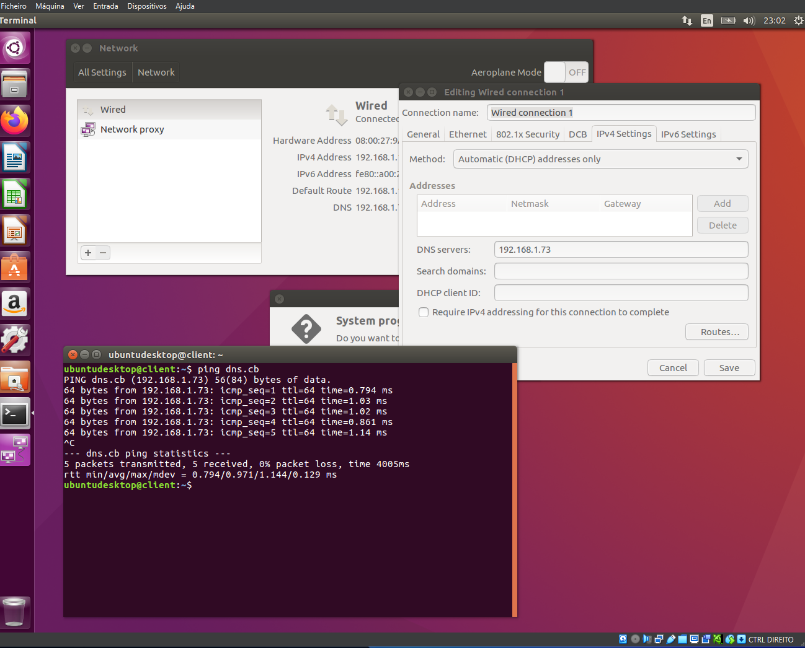

1) Configuração do servidor primário do domínio de topo “cb”

1) Configuração do servidor primário do domínio de topo “cb”
a) Configure o servidor primário do domínio de topo “cb”, de modo a este gerir o domínio
de topo “cb”, com os seguintes timeouts:
▪ Refresh 10 minutos
▪ Retry 1 minuto
▪ Expire 1 dia
▪ TTL 20 segundos
b) Introduza um registo de tipo “A”, relacionando o nome dns.cb com o endereço IP do
servidor primário;


```bash
sudo apt update
sudo apt install bind9 bind9utils bind9-doc -y
```

⚙️ 2️⃣ Editar o ficheiro principal de configuração

Abrir:
```bash
nano /etc/bind/named.conf.local
```

Adicionar no final:

```bash
zone "cb" {
    type master;
    file "/etc/bind/db.cb";
};
```

> Isso diz ao BIND9 que este servidor é o mestre (primário) do domínio “cb” e vai usar o ficheiro de zona /etc/bind/db.cb.


🧠 3️⃣ Criar o ficheiro de zona do domínio “cb”

Cria o ficheiro baseado no modelo padrão:

```bash
cp /etc/bind/db.local /etc/bind/db.cb
nano /etc/bind/db.cb
```

Apaga o conteúdo antigo e substitui por:

```bash
$TTL 20
@   IN  SOA dns.cb. root.cb. (
        1        ; Serial
        10M      ; Refresh (10 minutos)
        1M       ; Retry (1 minuto)
        1D       ; Expire (1 dia)
        20       ; Negative Cache TTL
)
; Servidor DNS primário
    IN  NS   dns.cb.
; Registo A do servidor DNS
dns IN  A    192.168.1.73

```


💡 Explicação:

@ representa o domínio “cb”.

root.cb. é o email do administrador (equivalente a root@cb).

Os tempos (10M, 1M, etc.) estão nos valores pedidos na ficha.

O registo A liga o nome dns.cb ao IP do servidor.

Esta configuracao esta salva na pasta compartilhada e pode ser copiada para o local desejado 

```bash
cp /mnt/VirtualBoxShared/server1/etc/bind/db.cb /etc/bind/db.cb
```

⚙️ 4️⃣ Verificar configuração

Executa:

```bash
named-checkconf
named-checkzone cb /etc/bind/db.cb
```

🔁 5️⃣ Reiniciar o serviço

```bash
systemctl restart bind9
systemctl enable bind9
```

🧩 6️⃣ Testar

Verifica se o DNS responde:

```bash
dig @192.168.1.73 dns.cb
```

ou

```bash
nslookup dns.cb 192.168.1.73
```

c) Configure o cliente para usar este servidor primário como servidor de DNS;
d) Verifique, no cliente, o que acontece quando executa o comando: “ping dns.cb”. O
nome “dns.cb” deve ser transformado no respetivo endereço IP e o ping para esse
endereço IP deve funcionar.




## 2) Configuração do servidor de sub-domínio

a) Configure o servidor primário do domínio de topo “cb”, de modo a delegar o
subdomínio “danune.cb”para o servidor primário DNS “milk.danune.cb”;

🧩 1️⃣ Contexto

Servidor atual: server1 (dns.cb)

Zona: cb

Subdomínio a delegar: danune.cb

Servidor primário do subdomínio: milk.danune.cb → 192.168.1.116

Servidor secundário: cow.danune.cb → 192.168.1.13

⚙️ 2️⃣ Editar o ficheiro de zona “cb”

Abre o ficheiro da zona cb, geralmente localizado em:


```bash
/etc/bind/db.cb
```

Adiciona no final as seguintes linhas:

```bash
; ---------------------------------------------------
; Delegação do subdomínio danune.cb
; ---------------------------------------------------
danune.cb.      IN  NS  milk.danune.cb.
danune.cb.      IN  NS  cow.danune.cb.

; Registos A correspondentes aos servidores delegados
milk.danune.cb. IN  A   192.168.1.116
cow.danune.cb.  IN  A   192.168.1.13
```

| Linha                                | Função                                                                    |
| ------------------------------------ | ------------------------------------------------------------------------- |
| `danune.cb. IN NS milk.danune.cb.`   | Diz ao DNS que o domínio **danune.cb** será gerido pelo servidor **milk** |
| `danune.cb. IN NS cow.danune.cb.`    | Adiciona redundância com o **servidor secundário cow**                    |
| `milk.danune.cb. IN A 192.168.1.116` | Cria o registo A para o host milk                                         |
| `cow.danune.cb. IN A 192.168.1.13`   | Cria o registo A para o host cow                                          |


🔄 4️⃣ Verifica a configuração

No servidor dns.cb, executa:

```bash
named-checkzone cb /etc/bind/db.cb
systemctl restart bind9
```

🔍 5️⃣ Testa a delegação

No dns.cb, faz: 

```bash
dig @192.168.1.73 danune.cb NS
```


