## 🧠 2️⃣ Verificar as sessões TCP com o comando netstat

## 2.Conceitos fundamentais sobre as sessões TCP
a) Dentro da VM, ligue o webbrowser e abra um website (por exemplo rtp.pt);


### b) Usando a ferramenta netstat, verifique quantas sessões TCP existem.

Passos:

Abra o terminal dentro da VM.

Execute o comando:

> netstat -tn

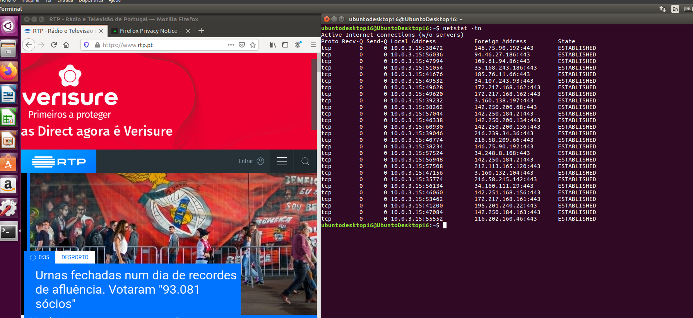

A opção -t faz com que o netstat mostre apenas as conexões TCP e -n exibe os endereços IP e números de portas no formato numérico (sem resolver nomes DNS).

### c) Provavelmente, cada sessão deve ter um estado: LISTENING, CLOSE_WAIT, TIME_WAIT ou
ESTABLISHED. O que significa cada um destes estados?

| **Estado**      | **Significado**                                                                                            | **Descrição**                                                                                |
| --------------- | ---------------------------------------------------------------------------------------------------------- | -------------------------------------------------------------------------------------------- |
| **LISTENING**   | O servidor está aguardando uma conexão.                                                                    | **Porta aberta para novas conexões.**                                                        |
| **ESTABLISHED** | Conexão bem-sucedida, dados estão sendo trocados.                                                          | **Conexão ativa.**                                                                           |
| **CLOSE_WAIT**  | O lado receptor recebeu a solicitação de fechamento e está aguardando o fechamento do outro lado.          | **Aguardando o fechamento final da conexão.**                                                |
| **TIME_WAIT**   | Espera para garantir que os pacotes da conexão sejam corretamente processados antes de reutilizar a porta. | **Esperando para garantir que todos os pacotes sejam entregues antes de reabrir a conexão.** |


🧠 6️⃣ Explicação prática dos estados

Quando um servidor web recebe uma solicitação de um navegador, a conexão TCP entra em ESTABLISHED enquanto os dados da página são trocados.

Quando o cliente clica em "Fechar" no navegador, o cliente envia um pacote FIN, o servidor passa para CLOSE_WAIT.

O servidor também envia seu pacote FIN para o cliente, que então entra no estado TIME_WAIT para garantir que a comunicação foi totalmente fechada antes de liberar a porta para novas conexões.


💡 Resumindo

LISTENING → Aguardando conexão.

ESTABLISHED → Conexão ativa, troca de dados.

CLOSE_WAIT → Aguardando que o outro lado finalize o fechamento.

TIME_WAIT → Garantindo que a conexão foi completamente fechada antes de reusar a porta.


### d) Usando a ferramenta netstat, verifique quantas sessões TCP estabelecidas existem.

🧩 1️⃣ Usar o comando netstat

Abra o terminal na tua máquina (Ubuntu Server ou Desktop).

Execute o seguinte comando para listar as conexões TCP estabelecidas:

> netstat -tn | grep 'ESTABLISHED'

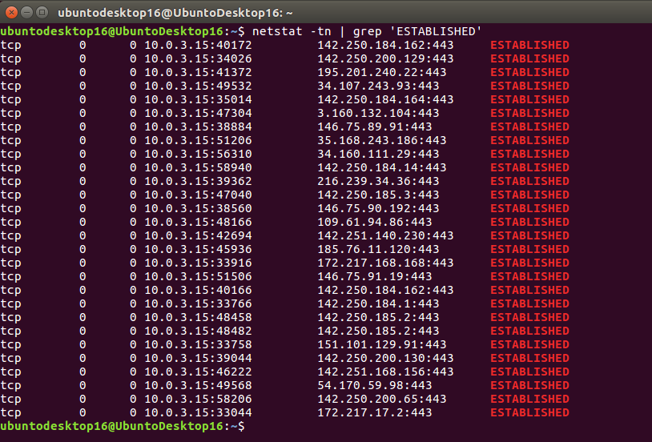

Explicação:

netstat -tn:

-t: Mostra apenas as conexões TCP.

-n: Mostra os endereços e portas numéricos, sem tentar resolver nomes.

grep 'ESTABLISHED': Filtra a saída para mostrar apenas as conexões em estado ESTABLISHED (ou seja, conexões ativas).

✅ 3️⃣ Contar quantas conexões ESTABLISHED existem
Para contar o número de conexões estabelecidas (ESTABLISHED), usa este comando:

> netstat -tn | grep 'ESTABLISHED' | wc -l

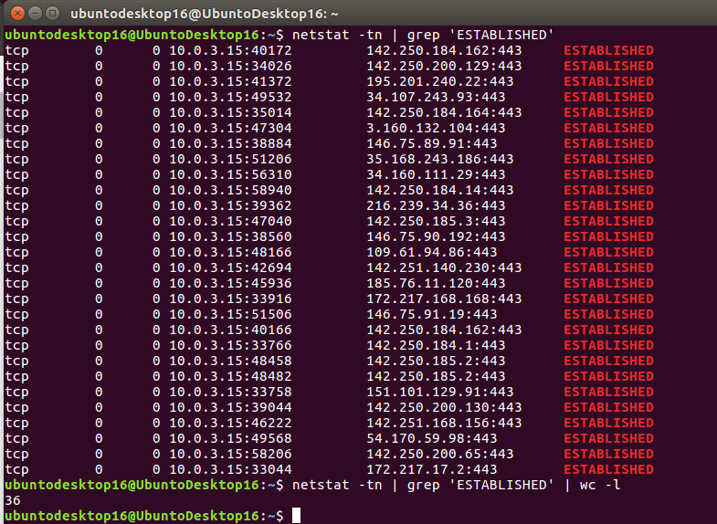

wc -l conta o número de linhas, ou seja, o número de conexões ativas.


🧩 1️⃣ Usar o comando netstat

Abra o terminal na tua máquina (Ubuntu Server ou Desktop).

Execute o seguinte comando para listar as conexões TCP e filtrar aquelas que estão paradas (esperando para terminar):

> netstat -tn | grep -E 'TIME_WAIT|CLOSE_WAIT'

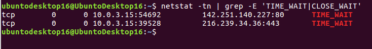

Explicação:

netstat -tn:

-t: Mostra apenas as conexões TCP.

-n: Exibe os endereços e portas numéricos (sem resolver nomes).

grep -E 'TIME_WAIT|CLOSE_WAIT': Filtra a saída para mostrar as conexões em TIME_WAIT e CLOSE_WAIT.


✅ 4️⃣ Contar o número de sessões paradas

Se quiseres contar o número de sessões paradas, usa o seguinte comando:

> netstat -tn | grep -E 'TIME_WAIT|CLOSE_WAIT' | wc -l


### f) Usando a ferramenta netstat, verifique se existem sessões TCP à escuta.

1️⃣ Usar o comando netstat

Abra o terminal na tua máquina (Ubuntu Server ou Desktop).

Execute o seguinte comando para listar as conexões TCP que estão em escuta:

> netstat -tn | grep 'LISTEN'


## 3.Conceitos fundamentais sobre o funcionamento do protocolo TCP

### g) Encontre um ficheiro na Internet para descarregar, com um tamanho entre 5 KB e 30 KB;

https://upload.wikimedia.org/wikipedia/commons/archive/2/24/20160319141616!LEGO_logo.svg

### h) Ligue o analisador de protocolos WireShark;

> sudo wireshark

🧩 4️⃣ (Alternativa) Usar tshark

> tshark -D

Captura a interface desejada:
Para capturar a rede na interface da VM (supondo que seja enp0s3):

> sudo tshark -i enp0s3

Filtros 

 (udp.port == 53 || tcp.port == 53)
 udp.port == 53 && ip.addr == 172.16.32.1


## j) Analise a sessão TCP no WireShark (aplique um filtro de modo a visualizar apenas os dados
desta sessão)

Aplicar filtro para visualizar apenas os dados da sessão

Abra o Wireshark e inicie a captura ou abra a captura salva.

No campo de filtro de exibição, usa o filtro para visualizar apenas o tráfego TCP:
> tcp
Ou, para filtrar por um endereço IP específico:

> ip.addr == <IP da máquina> && tcp

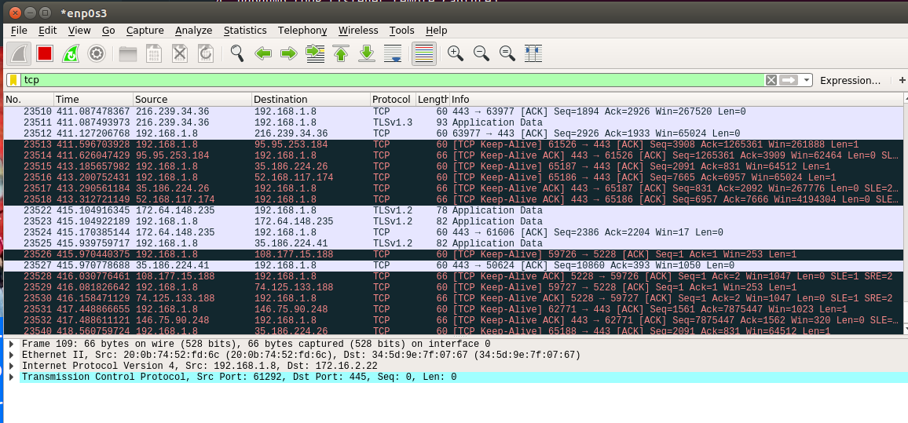

Identificar a sessão TCP

Quando a conexão for estabelecida (com o 3-way handshake), o Wireshark mostrará pacotes de SYN, SYN-ACK e ACK.

Para filtrar uma sessão específica, usa o Transaction ID ou IP e Porta.

### i) Identifique os segmentos TCP usados para estabelecer a ligação. (3-way handshake)

Filtros para os 3 pacotes iniciais:
No Wireshark, procura os pacotes com os seguintes indicadores:

SYN (pedido para iniciar a conexão)

SYN-ACK (resposta do servidor)

ACK (confirmação do cliente)

Exemplo de filtro para mostrar apenas SYN e SYN-ACK:

> tcp.flags.syn == 1


### ii) Quais foram os portos usados na ligação?

Para ver os portos usados, expanda o campo de protocolo TCP no Wireshark.

Você verá algo assim:

```yaml
Transmission Control Protocol, Src Port: 41322, Dst Port: 80
```

Aqui, 41322 é a porta de origem e 80 é a porta de destino.


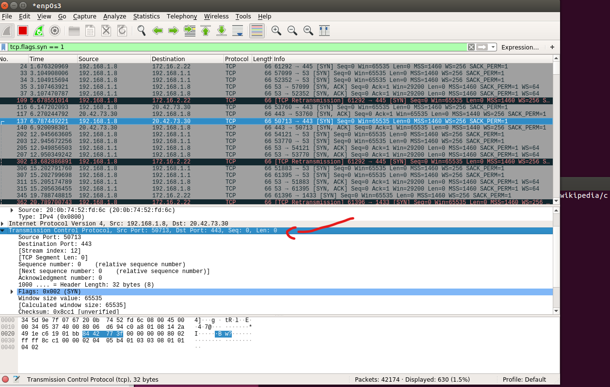


### iii) Quais são os números de sequência iniciais (valores absolutos)?

Expanda a informação de TCP no pacote.

O número de sequência inicial estará em algo como:

```yaml
Sequence Number: 0 (relative) or 1000 (absolute)
```

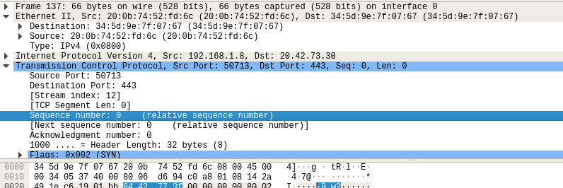

### iv) Qual é o valor do MSS - Maximum Segment Size?
O valor MSS é mostrado nos pacotes SYN durante a negociação de conexão.

Expanda o campo TCP Options.

Você verá algo como:

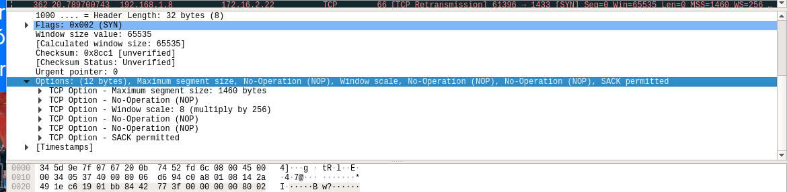

O valor do MSS é o tamanho máximo de segmento que pode ser transmitido durante a sessão TCP.

### v) Quantos segmentos foram necessários para transportar os dados;

Para contar quantos pacotes foram enviados para transportar dados, olhe para os pacotes com dados de payload (não apenas o SYN, ACK, FIN).

No Wireshark, isso estará nas colunas:

Length: Mostra o número de bytes transmitidos.

TCP Payload: A quantidade de dados sendo enviada no segmento TCP.

Você pode contar os pacotes onde a coluna Length é maior que 0.


### vi) Como evoluiu o valor da janela de receção do lado do recetor?

A janela de recepção indica a quantidade de dados que o recetor está pronto para receber.

Expanda o campo TCP e procure:

```yaml
Window size value: 8192 (bytes)

```

Esse valor vai mudar ao longo da conexão, conforme o controle de fluxo da rede.

No Wireshark, podes filtrar por “Window Size”:

```plaintext
tcp.window_size
```

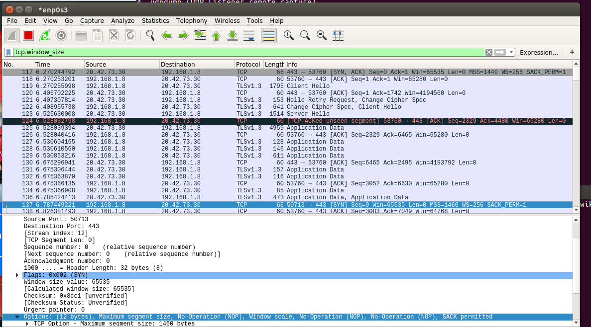

### vii) Como foi terminada a sessão?

Para ver como a sessão foi terminada, olhe para os pacotes FIN.

A finalização da conexão ocorre quando:

Cliente envia FIN → Server responde com FIN → Cliente confirma com ACK.

Procure pacotes com o flag FIN:

```plaintext
tcp.flags.fin == 1
```

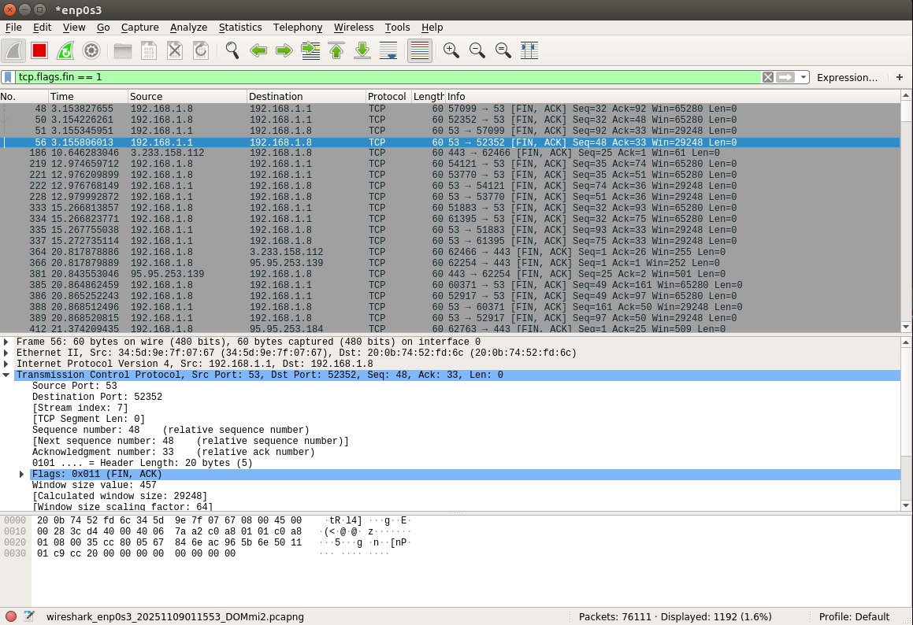

A sequência para terminar é:

FIN enviado pelo cliente.

FIN-ACK enviado pelo servidor.

ACK final do cliente.


✅ Resumo do que fizemos

Aplicar filtro TCP no Wireshark para capturar a sessão TCP.

Identificar segmentos de handshake (SYN, SYN-ACK, ACK).

Verificar os portos e números de sequência.

Observar o valor MSS.

Contar segmentos de dados.

Analisar a evolução da janela de recepção.

Verificar como a sessão TCP foi terminada com o pacote FIN.


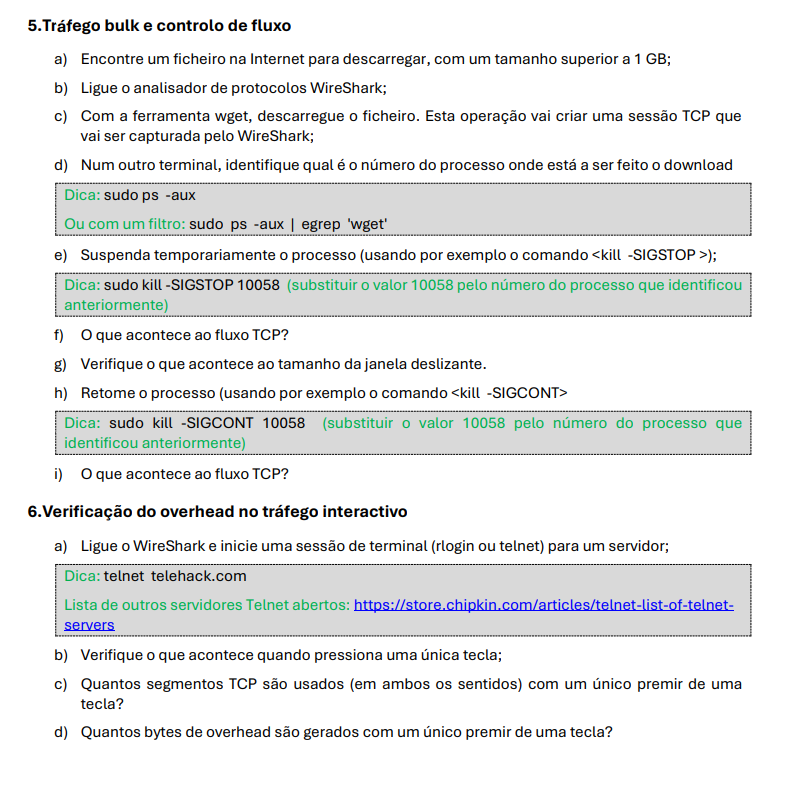